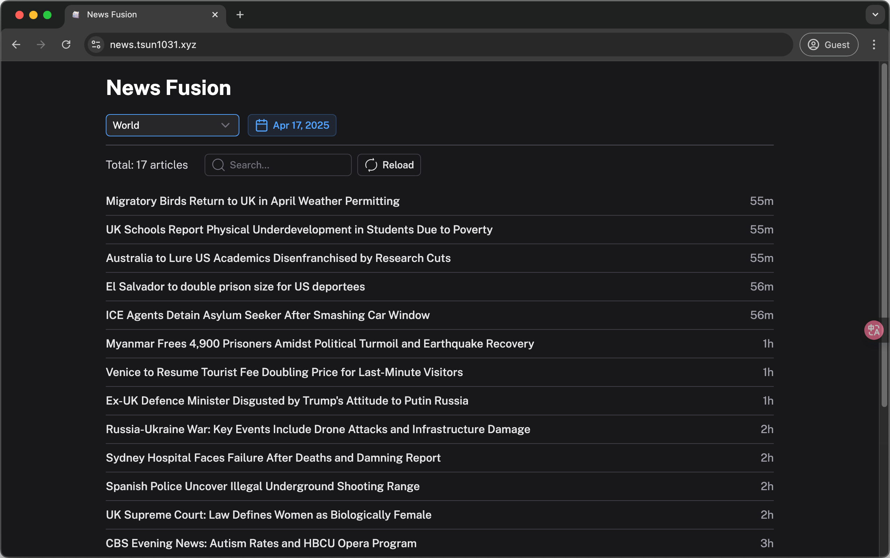

# News Fusion Web

Web version of News Fusion, aimed to combine the news from different sources and provide a better experience for the users powered by LLM and Embeddings models.

Screenshots of the web version:

## Immersive Translate

We have integrated the Immersive Translate to enable splitted translation of the content.

SDK is automatically loaded and initialized when the page is loaded.

If you have separately installed it's extension, you can use apply the configuration in developer settings.

You can access `/immersive-translate` to see the translation in action.
